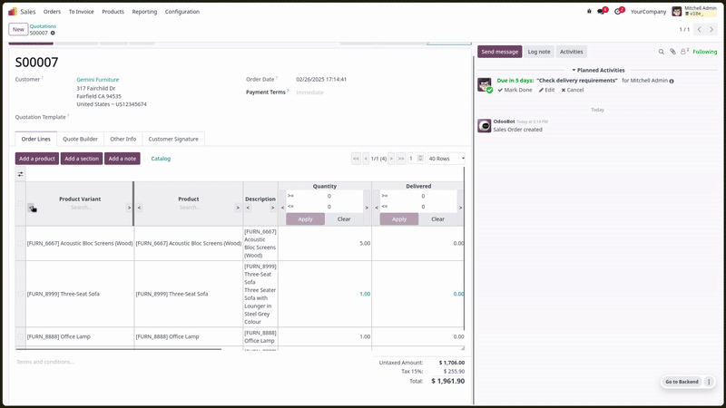
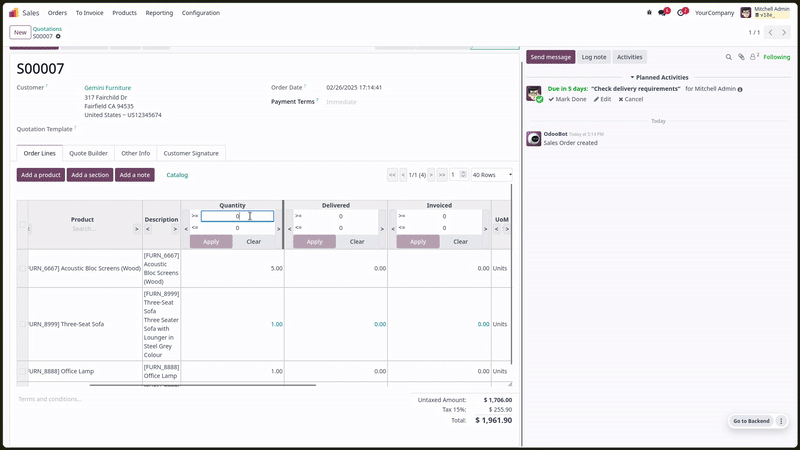
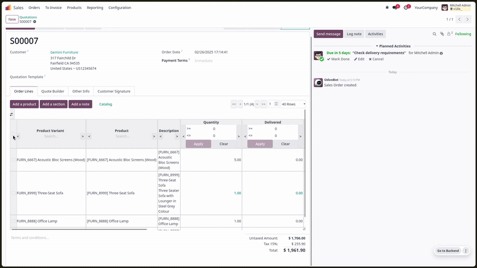

This module adds extra features to x2 widgets (one2many, many2many)
- Sticky header

- Fuzzy search filters on each column

- Multi deletion

And so much more, there are many interesting features from `TanStackTable <https://tanstack.com/table/latest>`, waiting to be implemented.
